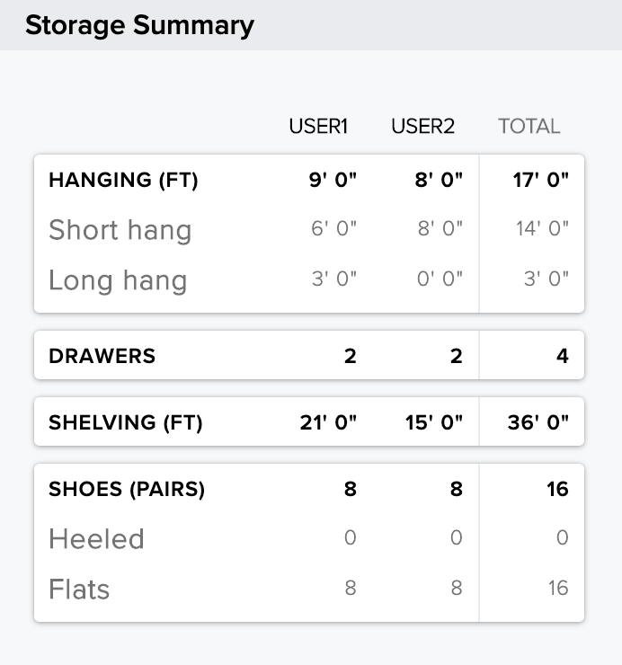
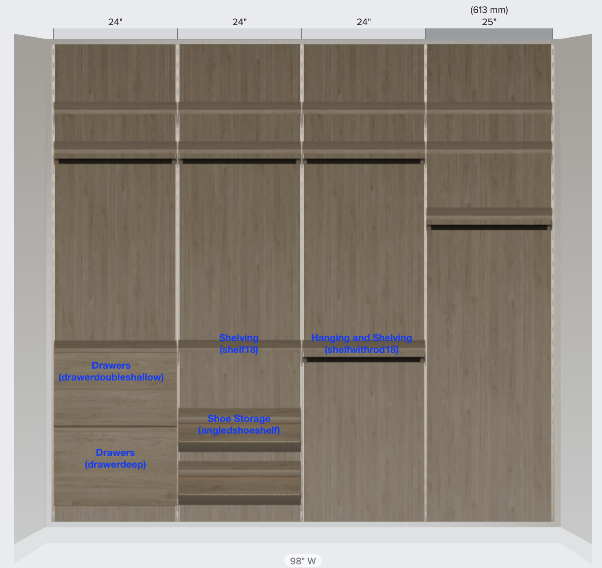

# Pairing-Exercise-ReactJS
#### Instruction
- clone this repo and make a new branch to work on.
- ```npm install```
- ```npm start```
- Go to http://localhost:3000
- The buttons and images are just visual aids for showing you what the closet represented by the three sample space documents look like
- Your primary goal is to complete the component that shows a summary of available storage
- Make a PR with your work (if you don't have access github access for the PR let us know)

#### Story
Show the user(s) how much storage of each type is available in their closet design
 - shelving in feet/inches
 - number of drawers
   - a ```drawerdoubleshallow``` is actually two drawers
 - hanging space in feet/inches
   - for now we won't worry about long hang vs short hang
 - potential number of shoes
   - an ```angledshoeshelf``` can hold 3 or 4 pairs of shoes on a 24" or 32" shelf
 - This story has been started, but is not complete

#### Space Document
- ```spaceDocument.design.elements``` is a list of the closet products in this space
  - elements belong to a ```section```, identified by a ```sectionId```
  - elements DO NOT have a ```width``` or ```user``` property, those can be found on the matching ```section```
  - elements have a ```y``` value that measure how far they are from the floor in millimeters
  - elements that provide shelving storage have a ```type``` of ```shelf18``` or ```shelfwithrod18```
  - elements that provide drawers have a ```type``` of  ```drawerdeep``` or ```drawerdoubleshallow```
  - elements that provide hanging storage have a ```type``` of ```shelfwithrod18```
    - hanging storage can be further broken down to long hang and short hang
  - elements that provide shoe storage have a ```type``` of ```angledshoeshelf```
- ```spaceDocument.design.zones``` is a list of areas on a wall(s) that products can be placed on
  - a zone has a list of ```sections```
    - a section has an ```id```
    - a section has a ```width``` in millimeters
    - a section had a ```userId``` that indicates which user will be using that section
- ```spaceDocument.design.users``` is a list of users
  - a user has an ```id```

#### Reference Images
Example of an existing storage summary panel for a different product line:


Visual Guide to the Element types in this exercise

